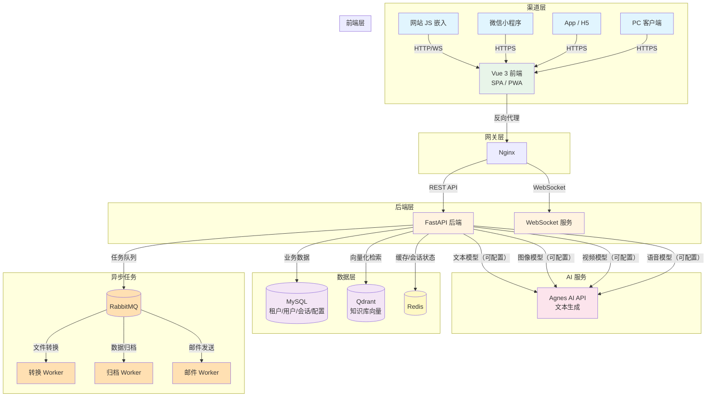

# 智能客服 PRD v2

> 基于 v1 升级，新增多租户 SaaS、用户体系、工单系统、语音能力、OCR、国际化等功能。

## 一、项目概述

基于 Agnes AI 多模型（文本、图像、视频、语音），使用 Vue 3 + FastAPI 前后端分离架构，构建支持**多租户 SaaS 化部署**、多渠道接入的企业级 AI 智能客服系统。

## 二、目标用户

1. **租户（商家）**：购买 SaaS 服务的中小企业/品牌方
2. **消费者**：租户网站的终端用户
3. **运营团队**：租户内部的客服管理人员

## 三、系统架构

### 3.1 技术栈

| 层级 | 技术 |
|---|---|
| 前端 | Vue 3 + Vite + Element Plus |
| 后端 | Python FastAPI |
| 业务数据库 | MySQL（按租户分库或 schema 隔离或共享表） |
| 向量数据库 | Qdrant |
| 缓存 | Redis |
| 消息队列 | RabbitMQ / Celery |
| AI 模型 | Agnes AI（模型版本可动态配置） |
| 文件转换 | python-docx、pandas、pdfplumber |
| 部署 | Docker + Docker Compose + Nginx |

### 3.2 核心模块

| 模块 | 职责 |
|---|---|
| 前端 (Vue 3) | 聊天界面、文件/图片上传、数据看板、后台管理（RBAC + 用户 + 菜单管理） |
| 后端 (FastAPI) | REST API、WebSocket 实时通信、会话管理、文件转换、异步任务 |
| 知识库 | 静态文档（Markdown 导入/转换）+ 动态数据库，检索走向量数据库 |
| MySQL | 用户、租户、会话、对话历史、知识库条目、统计数据、角色配置 |
| Qdrant | 知识库文档向量化存储，语义检索 |
| Redis | 缓存热点数据、会话状态、限流计数 |
| RabbitMQ | 异步任务（文件转换、数据归档、邮件发送） |

## 四、功能模块

### 4.1 多租户 SaaS

#### 4.1.1 租户管理
- **租户注册**：支持自助注册和邀请注册两种模式
- **租户信息**：企业名称、行业分类、联系人、联系方式
- **租户套餐**：免费版、标准版、专业版、企业版，不同套餐限制不同功能
  - 免费版：单客服、1000 条对话/月、基础知识库
  - 标准版：5 客服、10000 条对话/月、完整知识库
  - 专业版：20 客服、50000 条对话/月、高级分析
  - 企业版：不限客服、无限对话、定制功能
- **租户隔离**：采用混合隔离策略，根据租户套餐选择部署模式
  - **共享表模式**（免费版/标准版）：所有租户共用一张表，通过 `tenant_id` 字段隔离，成本低、运维简单
  - **独立 Schema 模式**（专业版）：每个租户拥有独立的 Schema，数据物理隔离，适合中型企业
  - **独立数据库模式**（企业版）：每个租户拥有独立的数据库实例，最高级别的隔离性和安全性，支持定制部署

#### 4.1.2 租户后台
- 每个租户拥有独立的后台管理界面
- 租户管理员可配置本租户的所有参数
- 租户间共享平台级配置（如 AI 模型供应商）

### 4.2 用户体系

#### 4.2.1 注册用户
- 消费者可注册平台账号，跨租户使用统一身份
- 支持手机号、邮箱、微信、QQ 多种注册方式
- 用户资料：昵称、头像、性别、生日、地区

#### 4.2.2 会员等级
- 根据消费金额/活跃度自动划分等级：普通、白银、黄金、钻石
- 不同等级享受不同权益（如优先接入人工、专属客服通道）

#### 4.2.3 积分体系
- 签到、评价、分享等行为获得积分
- 积分可兑换优惠券、会员时长

### 4.3 聊天核心

#### 4.3.1 多轮对话
- 用户发送消息，后端调用配置的文本模型返回 AI 回复
- 对话上下文通过 MySQL 存储，每次对话携带最近 N 轮消息（可配置，默认 10 轮）
- 支持流式输出（SSE/WebSocket），降低用户感知延迟
- 支持**上下文记忆**：跨会话记忆用户偏好和历史问题

#### 4.3.2 图片识别
- 用户上传图片后，后端调用配置的图像识别模型进行图像理解
- 返回图片描述，AI 结合上下文生成回复

#### 4.3.3 视频理解
- 用户上传视频后，后端调用配置的视频分析模型进行视频分析
- 返回视频关键帧描述或摘要，AI 基于描述生成回复

#### 4.3.4 语音能力（v2 新增）
- **语音输入**：用户发送语音，后端调用 ASR 模型转为文本后送入 AI
- **TTS 回复**：AI 回复可选择语音形式播放，支持多种音色和语速
- **语音消息上传**：支持 .wav/.mp3/.ogg 格式，最大 10MB

#### 4.3.5 OCR 识别（v2 新增）
- 用户上传截图/照片，后端调用 OCR 模型识别文字内容
- 识别结果直接作为对话上下文，AI 基于文字内容回复
- 支持中文、英文、日文等多语言识别

#### 4.3.6 转人工
- 支持三种触发模式（后台配置）：
  - **用户主动触发**：用户点击"转人工"按钮
  - **AI 自动触发**：AI 识别到问题不在知识库范围内（置信度低于阈值），主动建议转人工
  - **两者结合**：以上两种方式均可触发
- 转人工后，AI 对话历史自动同步给人工客服

### 4.4 工单系统（v2 新增）

#### 4.4.1 工单创建
- 客服/用户均可创建工单
- 工单类型：咨询、投诉、退换货、技术支持、其他
- 工单优先级：低、中、高、紧急
- 支持关联对话记录，自动带入上下文

#### 4.4.2 工单流转
- 工单状态流转：待处理 → 处理中 → 待确认 → 已解决 / 已关闭
- 支持工单升级（低优先级 → 高优先级）
- 支持工单转派（分配给其他客服或部门）
- 超时自动提醒/升级

#### 4.4.3 工单 SLA
- 可配置响应时效（如紧急工单 30 分钟内响应）
- 可配置解决时效（如普通工单 24 小时内解决）
- 超时自动通知主管

#### 4.4.4 工单统计
- 工单数量趋势（日/周/月）
- 各类型工单占比
- 平均响应时长、平均解决时长
- 客服工单处理排名

### 4.5 知识库管理

#### 4.5.1 静态文档管理
- 支持 Markdown 文件直接导入
- 导入后自动分块（chunk），调用 embedding 存入 Qdrant
- 支持按分类/标签检索

#### 4.5.2 动态数据库管理
- 后台 CRUD 管理 FAQ/产品信息/公告等
- 每条记录自动向量化存储到 Qdrant
- 支持搜索、筛选、批量导入导出

#### 4.5.3 知识库小工具

- **文件转换**：支持 PDF、Word（.docx）、Excel（.xlsx）上传，自动转换为 Markdown 格式
  - 转换完整保留：文字、表格、图片尽量保留原格式
  - 图片转为 base64 嵌入或引用链接
  - Excel 的每个 Sheet 转为独立的 Markdown 表格
- **在线预览**：转换后支持左右分栏预览
  - 左侧显示原文（PDF 渲染 / Word 预览 / Excel 表格）
  - 右侧显示转换后的 Markdown 代码
- **对比编辑**：可在线编辑 Markdown 内容
  - 实时预览渲染效果（右侧分栏改为三栏：原文 + Markdown 代码 + 渲染预览）
- **下载导出**：支持下载转换后的 Markdown 文件（.md 格式）
- **转换记录**：记录每次转换历史，支持批量转换和多文件上传
- **一键入库**：转换预览满意后，可直接将 Markdown 内容导入知识库

### 4.6 数据分析

#### 4.6.1 对话统计
- 今日/本周/本月对话总量趋势图
- 平均响应时长、峰值时段分布
- 在线用户数实时监控

#### 4.6.2 常见问题分析
- Top 10 用户提问词频统计
- 未匹配知识的问题聚类分析（用于补充知识库）

#### 4.6.3 用户满意度
- 对话结束后主动弹出满意度问卷
- 默认好评（默认 5 星，用户可修改或留言）
- 统计维度：好评率、各角色评分分布

#### 4.6.4 埋点分析（v2 新增）
- 用户行为追踪：页面停留时长、点击热区、功能使用频率
- 漏斗分析：注册 → 首次对话 → 满意度评价 → 复访
- 用户画像：基于行为数据的用户兴趣标签

### 4.7 后台管理

#### 4.7.1 RBAC 角色权限管理

基于 RBAC（Role-Based Access Control）模型设计，通过角色-权限映射控制后台操作权限。

**数据模型：**

| 表名 | 字段 | 说明 |
|:--|:--|:--|
| tenant | id, name, industry, contact_email, phone, status, plan, created_at, updated_at | 租户表 |
| admin_user | id, tenant_id, username, password_hash, email, avatar, status, created_at, updated_at | 管理员账号表 |
| role | id, tenant_id, name, code, description, status, created_at | 角色表 |
| permission | id, name, code, resource, action, description | 权限表 |
| role_permission | role_id, permission_id | 角色-权限关联表 |
| user_role | user_id, role_id | 管理员-角色关联表 |
| menu | id, tenant_id, parent_id, name, path, component, icon, sort_order, visible, type, created_at | 菜单表 |

**预设角色（按租户隔离）：**

| 角色 | 说明 | 权限范围 |
|:--|:--|:--|
| 超级管理员 | 拥有全部权限 | 所有模块的增删改查 |
| 运营管理员 | 负责日常运营 | 知识库管理、数据分析、角色配置 |
| 客服主管 | 监控服务质量 | 数据分析、转人工管理、满意度查看 |
| 普通客服 | 日常接待 | 聊天核心、转人工 |

**权限粒度：**

- **资源级别**：聊天、知识库、数据分析、角色管理、用户管理、系统配置、工单
- **操作级别**：查看、新增、编辑、删除、导出
- 每个角色的权限通过勾选矩阵配置，支持细粒度控制

#### 4.7.2 菜单管理

管理后台左侧导航菜单，支持树形结构和动态加载。

**功能列表：**

- **菜单树**：树形结构展示所有菜单节点，支持拖拽排序
- **菜单类型**：
  - **一级菜单**：左侧导航栏的顶级菜单项
  - **子菜单**：菜单下的二级/三级菜单项
  - **按钮权限**：菜单下的操作按钮（如"新增""编辑""删除"）
- **菜单属性**：
  - 菜单名称、路径（路由）、组件路径、图标、排序号
  - 可见性（显示/隐藏）
  - 关联权限码（与 permission 表绑定）
- **角色菜单绑定**：为每个角色分配可见的菜单列表
  - 超级管理员：可见全部菜单
  - 其他角色：仅可见分配的菜单
- **前端动态渲染**：
  - 登录后调用 `/api/admin/menu/roles` 获取当前角色的菜单树
  - 前端根据菜单树动态生成侧边栏导航
  - 按钮级权限通过指令 `v-permission` 控制显隐
- **预设菜单**：

| 菜单 | 子菜单 | 路径 | 组件 |
|:--|:--|:--|:--|
| 聊天核心 | 会话列表 | `/chat/sessions` | ChatSessions |
| 知识库管理 | 文档管理 | `/knowledge/docs` | KnowledgeDocs |
| 知识库管理 | 动态数据 | `/knowledge/data` | KnowledgeData |
| 知识库管理 | 小工具 | `/knowledge/tools` | KnowledgeTools |
| 数据分析 | 对话统计 | `/stats/chat` | StatsChat |
| 数据分析 | 常见问题 | `/stats/questions` | StatsQuestions |
| 数据分析 | 满意度 | `/stats/satisfaction` | StatsSatisfaction |
| 数据分析 | 埋点分析 | `/stats/events` | StatsEvents |
| 客服工作台 | 会话管理 | `/agent/sessions` | AgentSessions |
| 工单管理 | 工单列表 | `/ticket/list` | TicketList |
| 工单管理 | 工单看板 | `/ticket/board` | TicketBoard |
| 后台管理 | 租户管理 | `/admin/tenants` | AdminTenants |
| 后台管理 | 用户管理 | `/admin/users` | AdminUsers |
| 后台管理 | 角色管理 | `/admin/roles` | AdminRoles |
| 后台管理 | 菜单管理 | `/admin/menus` | AdminMenus |
| 后台管理 | 系统配置 | `/admin/config` | AdminConfig |
| 系统配置 | AI 模型配置 | `/admin/ai-models` | AdminAiModels |
| 系统配置 | 数据归档 | `/admin/archive` | AdminArchive |

#### 4.7.3 用户管理

管理后台管理员账号及其权限分配。

**功能列表：**

- **用户列表**：分页展示所有管理员账号，支持按用户名/邮箱/状态搜索
- **新增用户**：填写用户名、密码、邮箱、头像，分配一个或多个角色
- **编辑用户**：修改基本信息、重置密码、切换状态（启用/禁用）
- **删除用户**：软删除，标记 `status = disabled`
- **用户日志**：记录登录时间、操作记录（谁在什么时候做了什么）

#### 4.7.4 客服工作台

客服人员在后台查看用户聊天记录并主动介入对话，界面采用聊天软件形式（类似微信/QQ 的对话窗口）。

**功能列表：**

- **会话列表**：左侧展示所有正在进行的会话列表
  - 显示用户昵称、最后一条消息、会话状态（AI 接待中 / 人工接待中 / 已结束）
  - 未读消息数红点提示
  - 支持按状态筛选、按时间排序、搜索用户
- **会话详情**：右侧展示聊天窗口，样式参考常见聊天软件
  - 消息气泡形式展示对话内容（用户消息靠右、客服/AI 消息靠左）
  - 支持消息类型：文本、图片、视频、语音
  - 消息时间戳显示
  - 自动滚动到底部，新消息实时推送（WebSocket）
- **用户信息面板**：右侧边栏展示当前用户信息
  - 用户基本信息（昵称、头像、注册时间）
  - 当前会话状态（AI 接待中 / 人工接待中）
  - 订单状态、用户等级、来源渠道
  - 历史会话快捷入口
- **主动接管**：客服可随时从 AI 手中接管会话
  - 点击"接入对话"按钮，会话状态从 AI 接待中切换为人工接待中
  - 接管后 AI 停止自动回复，客服以聊天窗口形式直接回复
  - 接管时自动通知用户："客服已为您接入"
  - 支持撤回 AI 已发送的不合适回复
- **快捷回复**：提升客服效率
  - 预设常用回复话术（可后台配置），客服一键发送
  - 支持自定义话术分类（问候语、产品介绍、售后政策等）
  - 支持组合多条消息连续发送
- **会话结束**：
  - 客服主动结束当前会话
  - 会话结束后自动归档，对话记录存入 MySQL
  - 可发起满意度评价
- **多会话并发**：客服可同时接待多个用户
  - 每个会话以 Tab 标签页形式展示
  - 后台可配置最大并发会话数（默认 5）
  - 超出上限时新会话排队等待
- **评分统计**：按日/周/月/季度/年维度统计客服评分
  - 管理员可查看全部客服的评分数据
  - 普通客服仅可查看自己的评分
  - 统计维度：平均评分、好评率、评分分布（1-5 星）
  - 同时统计 AI 自动回复的满意度评分（与人工客服独立展示）
  - 支持按时间段对比趋势图
- **效率统计**：由管理员配置阈值，统计客服及 AI 的响应效率
  - **可配置指标**：
    - 首响时间阈值（默认 30 秒）
    - 平均响应时间阈值（默认 60 秒）
    - 会话处理时长阈值（默认 10 分钟）
    - 一次性解决率（首次回复即解决问题的比例）
  - **AI 客服统计**：
    - AI 平均响应时间（毫秒级，自动统计）
    - AI 自动解决率（未转人工的会话占比）
    - AI 转人工率（触发转人工的会话占比）
  - **人工客服统计**：
    - 人工首响时间（接管后首次回复用户的时间）
    - 人工平均响应时间
    - 人均会话处理量
    - 人均处理时长
  - 管理员可按日/周/月/季度/年查看对比趋势图

#### 4.7.5 系统配置

管理后台全局系统参数，各配置项通过键值对方式存储在 MySQL `system_config` 表中。

**功能列表：**

- **基础配置**
  - 系统名称、LOGO 设置
  - 系统公告/维护通知
  - 会话超时时间（默认 30 分钟无操作自动结束）
  - 默认轮数保留（多轮对话携带消息数，默认 10）
  - 默认满意度评分阈值（低于此值触发回访）
- **转人工配置**
  - 转人工触发模式（用户主动 / AI 自动 / 两者结合）
  - AI 自动转人工的置信度阈值（默认 0.3）
  - 转人工排队策略（轮询 / 按负载分配 / 按角色匹配）
- **数据归档配置**
  - 数据保留天数（默认 90 天）
  - 归档压缩格式（默认 .tar.gz）
  - 归档邮件发送间隔（默认每日凌晨 2 点）
  - SMTP 服务器参数（地址、端口、发件人、授权码）
- **满意度配置**
  - 问卷弹出时机（对话结束后立即 / 延迟 5 分钟）
  - 默认好评星级（默认 5 星）
  - 是否允许用户修改评分
  - 是否显示留言输入框
- **多渠道配置**
  - 各渠道接入参数（网站嵌入脚本、小程序 AppID、App Secret）
  - 各渠道聊天窗口样式（颜色、位置、尺寸）
  - 各渠道欢迎语（不同渠道可配不同文案）
- **文件转换配置**
  - 单次最大上传大小（默认 50MB）
  - 支持的文件类型（PDF / DOCX / XLSX）
  - 知识库单文件上限（默认 100MB）
  - 自动分块大小（默认 500 字符/块）
- **效率统计配置**
  - 首响时间阈值（默认 30 秒）
  - 平均响应时间阈值（默认 60 秒）
  - 会话处理时长阈值（默认 10 分钟）
  - 一次性解决率目标值
- **国际化配置（v2 新增）**
  - 支持语言列表（中文、英文、日文等）
  - 各语言的翻译词条管理
  - 用户语言偏好自动检测 + 手动切换
  - 聊天界面多语言自适应

#### 4.7.6 AI 模型配置

- **AI 模型配置**
  - 文本模型：配置文本生成模型的 API 地址、API Key、模型版本（默认 agnes-2.0-flash）
  - 图像模型：配置图像识别模型的 API 地址、API Key、模型版本（默认 agnes-image-2.1-flash）
  - 视频模型：配置视频分析模型的 API 地址、API Key、模型版本（默认 agnes-video-v2.0）
  - 语音模型（v2 新增）：配置 ASR/TTS 模型的 API 地址、API Key、模型版本
  - 模型切换：支持运行时切换模型版本，无需重启服务
  - 健康检查：定期检查各模型 API 连通性，异常时告警

#### 4.7.7 AI 客服角色管理

区别于后台管理员角色，这是 AI 客服本身的角色配置。

##### 4.7.7.1 多角色管理
- 支持创建多个客服角色，每个角色独立配置：
  - 角色名称（如"售后客服""售前咨询""技术支持"）
  - 系统提示词（角色人设、语气、专业领域）
  - 关联知识库（不同角色可绑定不同知识库）

##### 4.7.7.2 辅助信息自动切换
- 根据辅助信息自动切换角色：
  - 订单状态（待付款、待发货、已发货、已签收、售后中）
  - 用户等级（普通用户、VIP、企业客户）
  - 来源渠道（网站、小程序、App）
- 切换规则在后台配置（条件 → 角色映射表）
- 无匹配规则时，使用默认角色

### 4.8 数据归档

- **归档策略**：对话数据保留 90 天
- **归档方式**：超过保留期的对话数据压缩打包为 `.tar.gz` 格式
- **邮件通知**：归档文件通过附件发送到管理员配置的邮箱
- **邮箱配置**：管理员可在网页端配置 SMTP 服务器地址、端口、发件人邮箱、授权码
- **清理规则**：归档文件在邮件发送成功后从主库清理，压缩文件保留 180 天后自动删除

## 五、API 设计

### 5.1 聊天相关

| 方法 | 路径 | 说明 |
|:--|:--|:--|
| POST | `/api/chat` | 发送消息，返回 AI 回复（模型版本通过配置读取） |
| POST | `/api/upload/image` | 上传图片，调用图像识别模型 |
| POST | `/api/upload/video` | 上传视频，调用视频分析模型 |
| POST | `/api/upload/audio` | 上传语音，调用 ASR 模型（v2 新增） |
| POST | `/api/upload/ocr` | 上传截图，调用 OCR 模型（v2 新增） |
| POST | `/api/chat/transfer` | 转人工客服 |
| WS | `/ws/chat/{sessionId}` | WebSocket 实时聊天（v2 新增） |

### 5.2 知识库相关

| 方法 | 路径 | 说明 |
|:--|:--|:--|
| GET | `/api/knowledge` | 获取知识库列表 |
| POST | `/api/knowledge` | 导入/更新知识库 |
| DELETE | `/api/knowledge/:id` | 删除知识库条目 |
| POST | `/api/tools/convert` | 文件转 Markdown（PDF/Word/Excel） |
| GET | `/api/tools/history` | 获取转换历史记录 |
| GET | `/api/tools/download/:id` | 下载转换后的 Markdown 文件 |

### 5.3 数据分析

| 方法 | 路径 | 说明 |
|:--|:--|:--|
| GET | `/api/stats/chat` | 对话统计数据 |
| GET | `/api/stats/top-questions` | 常见问题 Top 10 |
| GET | `/api/stats/satisfaction` | 满意度统计 |
| GET | `/api/stats/events` | 埋点事件统计（v2 新增） |
| GET | `/api/stats/funnel` | 漏斗分析（v2 新增） |

### 5.4 后台管理（RBAC + 用户）

| 方法 | 路径 | 说明 |
|:--|:--|:--|
| POST | `/api/admin/login` | 管理员登录，返回 JWT |
| GET | `/api/admin/me` | 获取当前管理员信息 |
| GET | `/api/admin/users` | 获取管理员用户列表 |
| POST | `/api/admin/users` | 创建管理员用户 |
| PUT | `/api/admin/users/:id` | 更新管理员用户 |
| DELETE | `/api/admin/users/:id` | 禁用管理员用户 |
| GET | `/api/admin/roles` | 获取角色列表 |
| POST | `/api/admin/roles` | 创建角色 |
| PUT | `/api/admin/roles/:id` | 更新角色 |
| DELETE | `/api/admin/roles/:id` | 删除角色 |
| GET | `/api/admin/permissions` | 获取权限列表 |
| PUT | `/api/admin/roles/:id/permissions` | 分配角色权限 |
| GET | `/api/admin/logs` | 获取操作日志 |

### 5.4.1 菜单管理

| 方法 | 路径 | 说明 |
|:--|:--|:--|
| GET | `/api/admin/menu/tree` | 获取菜单树（含按钮） |
| GET | `/api/admin/menu/roles` | 获取当前角色菜单树（前端路由用） |
| GET | `/api/admin/menus` | 获取菜单列表（分页） |
| POST | `/api/admin/menus` | 创建菜单 |
| PUT | `/api/admin/menus/:id` | 更新菜单 |
| DELETE | `/api/admin/menus/:id` | 删除菜单 |

### 5.4.2 租户管理（v2 新增）

| 方法 | 路径 | 说明 |
|:--|:--|:--|
| GET | `/api/admin/tenants` | 获取租户列表（分页） |
| POST | `/api/admin/tenants` | 创建租户 |
| PUT | `/api/admin/tenants/:id` | 更新租户 |
| DELETE | `/api/admin/tenants/:id` | 禁用租户 |
| GET | `/api/admin/tenants/:id/stats` | 获取租户统计数据 |
| PUT | `/api/admin/tenants/:id/plan` | 变更租户套餐 |

### 5.5 系统配置

| 方法 | 路径 | 说明 |
|:--|:--|:--|
| GET | `/api/system/config` | 获取所有系统配置 |
| GET | `/api/system/config/:key` | 获取单个配置项 |
| PUT | `/api/system/config/:key` | 更新单个配置项 |
| PUT | `/api/system/config/batch` | 批量更新配置 |

### 5.6 客服工作台

| 方法 | 路径 | 说明 |
|:--|:--|:--|
| GET | `/api/agent/sessions` | 获取会话列表（支持状态筛选） |
| GET | `/api/agent/sessions/:id` | 获取会话详情（消息列表） |
| POST | `/api/agent/sessions/:id/takeover` | 客服接管会话（AI → 人工） |
| POST | `/api/agent/sessions/:id/reply` | 客服主动回复 |
| POST | `/api/agent/sessions/:id/quick-reply` | 使用快捷回复 |
| POST | `/api/agent/sessions/:id/ai-recall` | 撤回 AI 消息 |
| POST | `/api/agent/sessions/:id/close` | 结束会话 |
| GET | `/api/agent/sessions/:id/user` | 获取用户详细信息 |
| GET | `/api/agent/quick-replies` | 获取快捷回复列表 |
| POST | `/api/agent/quick-replies` | 新增/更新快捷回复 |

### 5.6.1 评分统计

| 方法 | 路径 | 说明 |
|:--|:--|:--|
| GET | `/api/agent/ratings` | 获取客服评分统计（支持日/周/月/季度/年） |
| GET | `/api/agent/ratings/:agentId` | 获取指定客服评分明细 |
| GET | `/api/agent/ratings/ai` | 获取 AI 客服评分统计 |
| GET | `/api/agent/ratings/trend` | 获取评分趋势对比（AI vs 人工） |

### 5.6.2 效率统计

| 方法 | 路径 | 说明 |
|:--|:--|:--|
| GET | `/api/agent/efficiency` | 获取效率统计概览 |
| GET | `/api/agent/efficiency/human` | 获取人工客服效率统计 |
| GET | `/api/agent/efficiency/ai` | 获取 AI 客服效率统计 |
| GET | `/api/agent/efficiency/trend` | 获取效率趋势对比（AI vs 人工） |
| PUT | `/api/agent/efficiency/thresholds` | 更新效率统计阈值配置 |

### 5.7 AI 客服角色与配置

| 方法 | 路径 | 说明 |
|:--|:--|:--|
| GET | `/api/config/roles` | 获取角色列表 |
| POST | `/api/config/roles` | 创建/更新角色 |
| DELETE | `/api/config/roles/:id` | 删除角色 |
| GET | `/api/config/switch-rules` | 获取自动切换规则 |
| PUT | `/api/config/switch-rules` | 配置自动切换规则 |
| GET | `/api/config/email` | 获取邮箱配置 |
| PUT | `/api/config/email` | 配置 SMTP 邮箱 |

### 5.8 数据归档

| 方法 | 路径 | 说明 |
|:--|:--|:--|
| POST | `/api/archive/run` | 手动触发归档 |
| GET | `/api/archive/status` | 查看归档状态 |

### 5.9 AI 模型配置

| 方法 | 路径 | 说明 |
|:--|:--|:--|
| GET | `/api/config/ai-models` | 获取所有模型配置 |
| GET | `/api/config/ai-models/:type` | 获取指定类型模型配置（text/image/video/audio） |
| PUT | `/api/config/ai-models/:type` | 更新指定类型模型配置 |
| POST | `/api/config/ai-models/:type/test` | 测试指定类型模型连通性 |

### 5.10 工单管理（v2 新增）

| 方法 | 路径 | 说明 |
|:--|:--|:--|
| GET | `/api/tickets` | 获取工单列表（分页、筛选） |
| POST | `/api/tickets` | 创建工单 |
| GET | `/api/tickets/:id` | 获取工单详情 |
| PUT | `/api/tickets/:id` | 更新工单（状态、优先级、备注） |
| POST | `/api/tickets/:id/assign` | 转派工单 |
| POST | `/api/tickets/:id/escalate` | 升级工单 |
| PUT | `/api/tickets/:id/close` | 关闭工单 |
| GET | `/api/tickets/:id/comments` | 获取工单评论 |
| POST | `/api/tickets/:id/comments` | 添加工单评论 |

### 5.11 国际化（v2 新增）

| 方法 | 路径 | 说明 |
|:--|:--|:--|
| GET | `/api/i18n/languages` | 获取支持的语言列表 |
| GET | `/api/i18n/translations` | 获取翻译词条列表 |
| POST | `/api/i18n/translations` | 新增翻译词条 |
| PUT | `/api/i18n/translations/:id` | 更新翻译词条 |
| DELETE | `/api/i18n/translations/:id` | 删除翻译词条 |
| GET | `/api/i18n/export` | 导出翻译文件（JSON/YAML） |

## 六、数据模型

### 6.1 业务数据表

#### 6.1.1 租户与用户

| 表名 | 字段 | 说明 |
|:--|:--|:--|
| tenant | id, name, industry, contact_email, phone, status, plan, created_at, updated_at | 租户表 |
| user | id, tenant_id, nickname, avatar, gender, birthday, region, membership_level, points, created_at, updated_at | 消费者用户表 |
| admin_user | id, tenant_id, username, password_hash, email, avatar, status, created_at, updated_at | 管理员账号表 |

#### 6.1.2 RBAC 权限

| 表名 | 字段 | 说明 |
|:--|:--|:--|
| role | id, tenant_id, name, code, description, status, created_at | 角色表 |
| permission | id, name, code, resource, action, description | 权限表 |
| role_permission | role_id, permission_id | 角色-权限关联表 |
| user_role | user_id, role_id | 管理员-角色关联表 |
| menu | id, tenant_id, parent_id, name, path, component, icon, sort_order, visible, type, created_at | 菜单表 |

#### 6.1.3 会话与消息

| 表名 | 字段 | 说明 |
|:--|:--|:--|
| session | id, tenant_id, user_id, channel, status, current_agent_type, created_at, updated_at | 会话表 |
| message | id, session_id, sender_type, content, content_type, created_at | 消息表 |
| satisfaction | id, session_id, score, comment, created_at | 满意度评价表 |

#### 6.1.4 工单系统

| 表名 | 字段 | 说明 |
|:--|:--|:--|
| ticket | id, tenant_id, session_id, creator_type, type, priority, status, assigned_to, sla_deadline, created_at, updated_at | 工单表 |
| ticket_comment | id, ticket_id, sender_type, content, created_at | 工单评论表 |

#### 6.1.5 知识库

| 表名 | 字段 | 说明 |
|:--|:--|:--|
| knowledge_entry | id, tenant_id, title, content, category, tags, vector_id, created_at, updated_at | 知识库条目表 |
| file_conversion | id, tenant_id, original_file, converted_md, status, created_by, created_at | 文件转换记录表 |

#### 6.1.6 系统与配置

| 表名 | 字段 | 说明 |
|:--|:--|:--|
| system_config | id, tenant_id, key, value, description, updated_at | 系统配置表 |
| translation | id, tenant_id, language, key, value, updated_at | 翻译词条表 |

#### 6.1.7 统计与分析

| 表名 | 字段 | 说明 |
|:--|:--|:--|
| agent_efficiency_log | id, tenant_id, agent_type, agent_id, first_response_time, avg_response_time, session_count, created_at | 效率统计日志表 |
| rating_record | id, tenant_id, agent_type, agent_id, score, session_id, created_at | 评分记录表 |
| event_log | id, tenant_id, user_id, event_type, event_data, ip, created_at | 埋点事件表 |

### 6.2 数据隔离策略

根据租户套餐选择不同的隔离模式：

| 套餐 | 隔离模式 | 说明 |
|:--|:--|:--|
| 免费版 | 共享表 | 所有租户共用一张表，通过 `tenant_id` 字段隔离 |
| 标准版 | 共享表 | 同上，数据量较大时可考虑拆分 |
| 专业版 | 独立 Schema | 每个租户拥有独立的 Schema，物理隔离 |
| 企业版 | 独立数据库 | 每个租户拥有独立的数据库实例，最高安全级别 |

**切换规则**：
- 租户升级套餐时，数据自动迁移到新的隔离模式
- 独立 Schema/数据库模式下，`tenant_id` 字段仍保留用于跨租户查询
- 所有模式均保证租户间数据不可见

### 6.3 向量检索

知识库文档导入 Qdrant 时的数据结构：

| 字段 | 说明 |
|:--|:--|
| payload.tenant_id | 租户 ID（隔离） |
| payload.title | 文档标题 |
| payload.category | 分类 |
| payload.tags | 标签列表 |
| payload.chunk_text | 分块文本内容 |
| vector | 向量化嵌入 |

## 七、多渠道接入

- **网站**：JavaScript 嵌入脚本，悬浮聊天窗口
- **微信小程序**：小程序组件接入
- **App**：SDK / H5 页面嵌入
- **PC 客户端**：桌面端应用（Electron）

## 八、非功能性需求

- 消息响应时间 < 3s
- 支持并发 ≥ 1000 用户（v2 升级）
- 对话数据保留 90 天后归档，压缩文件保留 180 天清理
- 文件转换支持单次最大 50MB
- 知识库文档最大单文件 100MB，自动分块存储
- **多租户数据隔离**：所有业务表均含 tenant_id，确保租户间数据严格隔离
- **缓存策略**：Redis 缓存热点配置、会话状态、排行榜数据
- **异步处理**：文件转换、数据归档、邮件发送通过消息队列异步执行
- **国际化**：支持至少中/英/日三种语言，前端自适应切换
- **SLA**：系统可用性 ≥ 99.9%，支持灰度发布和热更新