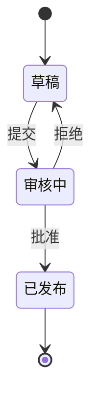
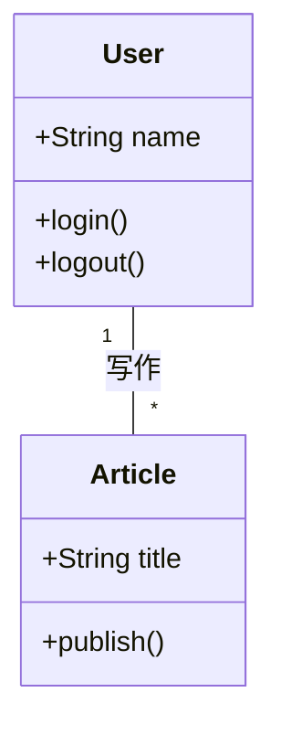
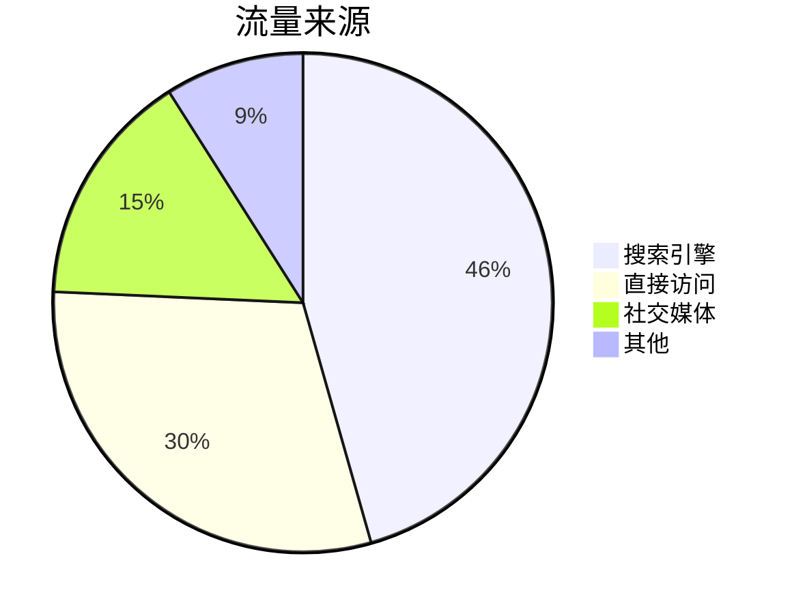
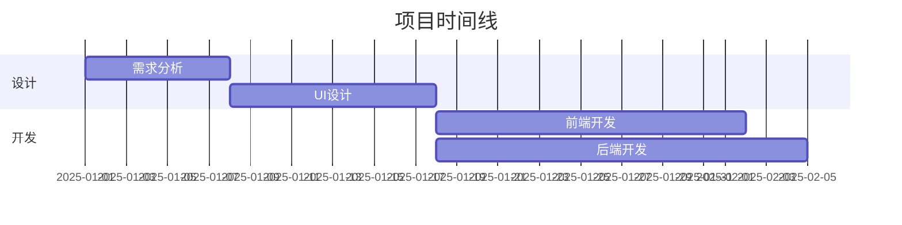
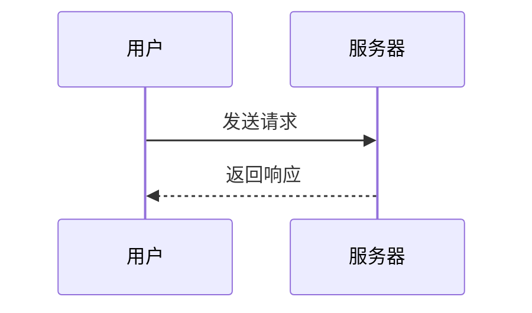
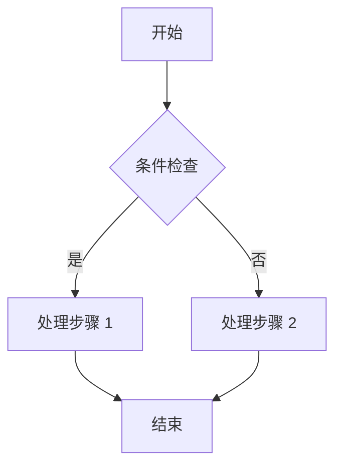

# 状态图

```mermaid
stateDiagram-v2
    [*] --> 草稿
    草稿 --> 审核中 : 提交
    审核中 --> 已发布 : 批准
    审核中 --> 草稿 : 拒绝
    已发布 --> [*]
```

# 类图

```mermaid
classDiagram
    class User {
        +String name
        +login()
        +logout()
    }
    class Article {
        +String title
        +publish()
    }
    User "1" -- "*" Article : 写作
```

# 饼图

```mermaid
pie title 流量来源
    "搜索引擎" : 45.6
    "直接访问" : 30.1
    "社交媒体" : 15.3
    "其他" : 9.0
```

# 甘特图

```mermaid
gantt
    title 项目时间线
    dateFormat YYYY-MM-DD
    section 设计
    需求分析 :a1, 2025-01-01, 7d
    UI设计   :a2, after a1, 10d
    section 开发
    前端开发 :b1, after a2, 15d
    后端开发 :b2, after a2, 18d
```

# 时序图

```mermaid
sequenceDiagram
    participant User as 用户
    participant Server as 服务器
    User->>Server: 发送请求
    Server-->>User: 返回响应
```

# 流程图

```mermaid
graph TD
    A[开始] --> B{条件检查}
    B -->|是| C[处理步骤 1]
    B -->|否| D[处理步骤 2]
    C --> E[结束]
    D --> E
```